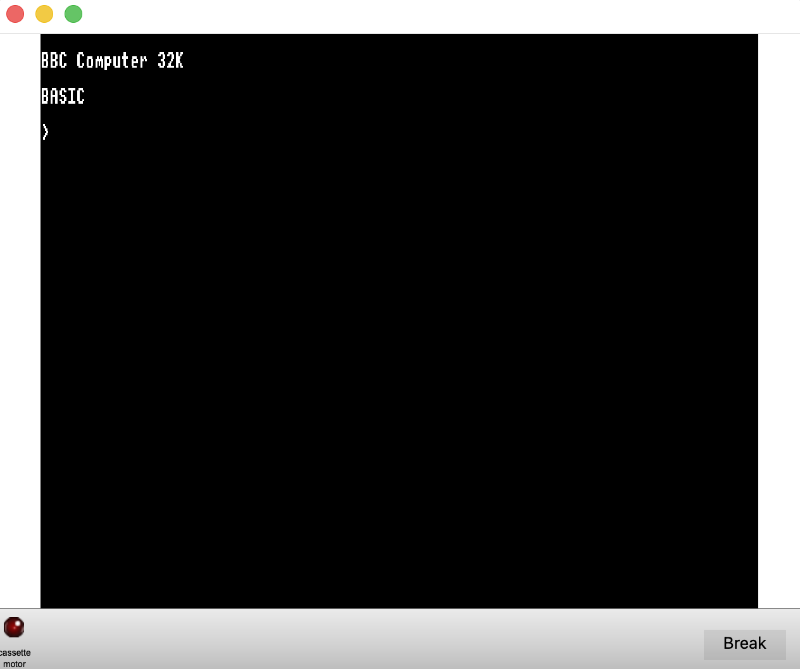
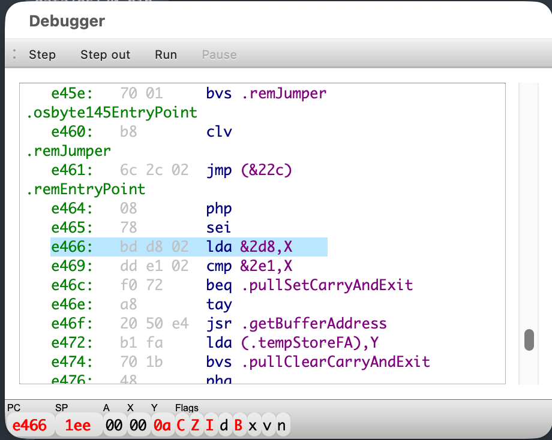
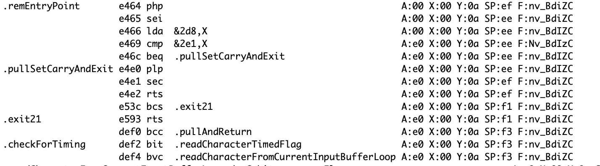
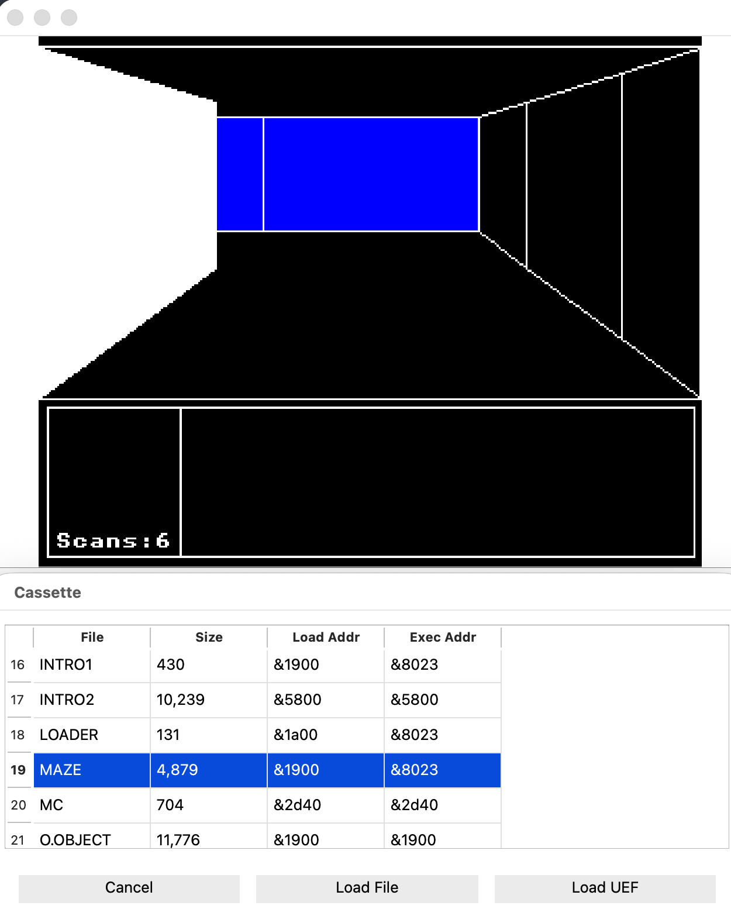

# BBC Micro Model B Emulator

Very much WIP. Current state of play:

* Boots and supports Basic program entry
* Support for Modes 0-6 (no TTX yet)
* No Audio
* Cassette in progress. There is a janky short cut to load data from UEF file into memory bypassing the Serial ULA
* Full debugger with breakpoints etc.

## To run
You'll need two ROMs, the OS1.2 and Basic ROMs. Drop them in a data directory under bin 
`data/os120.bin`
`data/Basic2.rom`

Then run `./beeb` Defualt boot mode is mode 0 but you can specify an alternative on the command prompt.

Sadly no satisfying be-boop yet.

## Menus

View - shows various other windows

### Debugger
View Debugger shows a simple debugger. It shows a disassembly of the memory and the PC and other registers at the bottom of the window

`Pause` stops execution
`Run` resumes
`Step` and `Step out` do the obvious thing.

If you want to make life easier for yourself, you can load OS symbols from `mos_symbols.txt` (taken from the Brilliant TobyLobster's ROM disassembly https://tobylobster.github.io/mos/mos/index.html)

Set a breakpoint by clicking to the left of the memory address or using the `Debugger->Add Breakpoint` menu option. This menu also allows you to
* Save and load breakpoints.
* Add watchpoints (execution will pause when a watched memory address changes) 
* Add Log Points (log an address content when the PC has a particular value)

`Debugger->Show History` dumps the contents of a circular buffer containing the last 100 instructions executed

### Trace (when Debugger window is open) 
Starts logging every instruction to stdout as it executes. Lots of data. Not recommended.

### Memory
A memory inspector. View the contents of RAM.

### Cassette 
Allows you to load a UEF file and see the contents. 
![[images/cassette.png]]Sadly does not yet support loading from the Beeb via LO."" or CH.""  -- cursed sula timing bug to resolve -- but you *can* press "Load File" to pull the data directly into RAM (at the address listed in the UEF window) For BASIC programs you can then 
```
PA.=&1900
LIST
RUN
```
Where &1900 should be the address at which you loaded the code.



